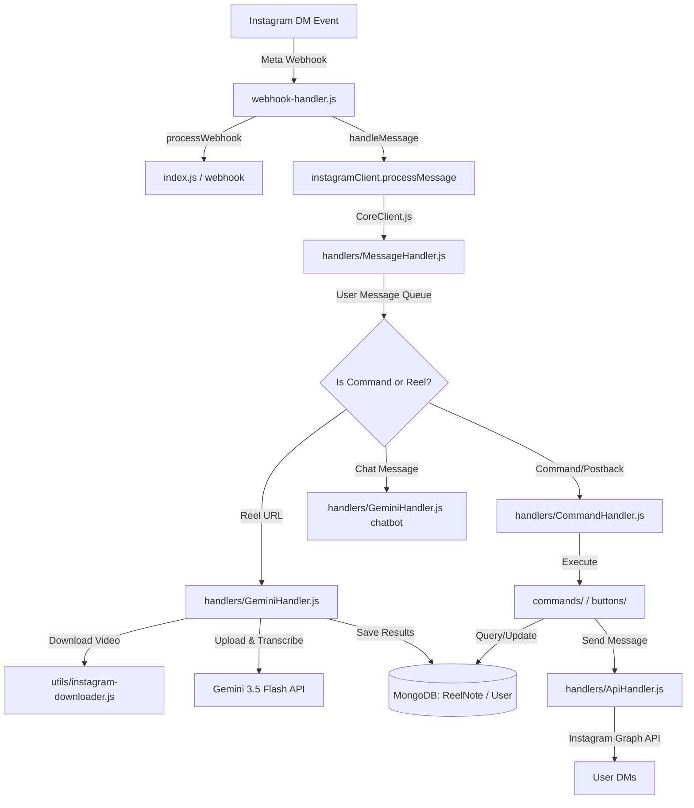

<p align="center">
    <h1 align="center">ReeF - Instagram Timetable & Reel NoteTaker</h1>
</p>
<p align="center">
    <em>Automated Study Scheduling & Reel Transcription Inside Instagram DMs</em>
</p>
<p align="center">
	
	
	
	
</p>

---

**Your Instagram "Saved" folder isn't a learning system. It's a graveyard.**

Every time you find a great coding tutorial, productivity tip, or educational Reel, you hit **Save** and tell yourself:

> "I'll watch it later."

Later almost never comes.

**What if Instagram itself became your study companion instead of just another source of distractions?**

That's why I built **ReeF**.

An AI-powered assistant that lives inside Instagram DMs and transforms educational Reels into an actual learning workflow:

* 📩 **Share** an educational Reel with ReeF.
* 🧠 **Ingest & Analyze**: It transcribes the video, extracts the important concepts, links, and action items.
* 📚 **Organize**: It converts everything into structured study notes you can actually revisit.
* 📅 **Schedule**: It automatically builds a study timetable around your schedule.
* ⏰ **Remind**: It reminds you when it's time to learn, not just when there's another Reel to watch.
* 📝 **Custom Notes**: If you don't have a Reel, simply send your own notes or ideas, and ReeF organizes them the same way.

The idea isn't to fight social media. It's to make the educational content we're already consuming actually stick.

---

## System Architecture



---

## Key Features
* **Automated Reel Analysis**: Downloads shared Reel videos, transcribes voice/overlays, and maps them to clean markdown summaries.
* **Dynamic Learning Timetable**: Suggests schedule slots for study routines and allows users to modify schedules via interactive commands.
* **Deadlines & Milestones**: Structures tasks and course deadlines, and triggers automated check-in summaries containing saved resources once deadlines complete.
* **Active DM Reminders**: Periodically polls user routine times and sends DM notifications to keep study habits active.
* **VPS Security Bypass**: Direct browser session cookie import bypasses datacenter IP blocks, avoiding password-based blocks on cloud hostings.
* **Concurrency Control**: Memory-safe sequential user-queues prevent race conditions and MongoDB write collisions.

---

## Commands Reference

All commands are prefixed with the bot's configured prefix (default: `!`).

* `!timetable [clear]` – Display your weekly study schedule or wipe it clean.
* `!notes [view <index>]` – List saved learning resources or view a specific summary in detail.
* `!reminders [clear]` – View scheduled study alerts or cancel all notifications.
* `!deadline [add <name> <date/relative> | list | clear]` – Configure study/task deadlines (e.g., `!deadline add Midterms 2026-07-20` or `!deadline add Finals 10d`).
* `!ping` – Verify backend response latency.

---

## Environmental Settings

Configure these keys inside a `.env` file at the root of the project:

```env
# Database Configuration
MONGO_URI=mongodb+srv://<user>:<password>@cluster.mongodb.net/timetable_bot

# Network Configuration
PORT=25655
TRUST_PROXY=1

# Gemini AI API Configuration
GEMINI_API_KEY=AIzaSy...

# Instagram Graph API Webhook Configuration
INSTAGRAM_ACCESS_TOKEN=IGAAQ...
INSTAGRAM_VERIFY_TOKEN=instagram_reel_timetable_token_verify
INSTAGRAM_APP_SECRET=bab62b11...

# Instagram Scraper Account (Used for authenticated Reel downloads)
IG_USERNAME=your_secondary_instagram_username
IG_PASSWORD=your_secondary_instagram_password

# Admin Bypass Key (Enforces security on session imports)
IG_CHALLENGE_TOKEN=your_secure_admin_bypass_token
```

---

## Session Cookie Import (VPS Bypass)

When hosting on a VPS or cloud container, Instagram blocks password-based authentication due to datacenter IP reputation. To bypass this, you can copy your browser's active session cookies from a personal machine and import them directly to the VPS:

### Step 1: Copy Cookies from Web Browser
1. Log in to Instagram on your laptop web browser.
2. Open **Developer Tools** (`F12`), navigate to the **Network** tab, and refresh the page.
3. Select any successful request to `instagram.com` (such as `graphql/query`).
4. Under **Request Headers**, locate the **`cookie`** header and copy its entire text (it will start with `mid=...` or `ig_did=...`).

### Step 2: Import Cookies via Web Browser
Open your web browser and navigate directly to the import URL, pasting your copied cookies at the end of the query string:

```
http://yourdomain.com/ig/session/import?token=your_challenge_token&cookies=YOUR_COPIED_COOKIE_STRING_HERE
```

#### Example GET Request Link:
```
http://yourdomain.com/ig/session/import?token=your_challenge_token&cookies=mid=akZkMAALAAGpmOkfOxmhzS_Wb1cY; ds_user_id=123456789; sessionid=123456789%3AAcc9QlyukJ9NNY%3A17%3AAYh_66PM
```

### Response Schema (API Reference)

* **Success Response (`200 OK`)**:
  ```json
  {
    "status": "success",
    "username": "your_instagram_username",
    "message": "Cookies imported and verified successfully!"
  }
  ```
* **Error Response (`400 Bad Request` / `501 Internal Server Error`)**:
  ```json
  {
    "error": "Cookies verification failed: GET /api/v1/accounts/current_user/?edit=true - 400 Bad Request; checkpoint_required"
  }
  ```

The bot will:
1. Load cookies into a secure, sandboxed tough-cookie jar.
2. Query Instagram's authenticated `currentUser` endpoint to prove validity.
3. Serialize the session state to `.ig-session.json` with owner-only (`0600`) file permissions.
4. Unblock downloads instantly without needing standard password-based logins.

---

## Production Nginx Configuration

Route incoming port `80`/`443` traffic to local port `25655`:

```nginx
server {
    listen 80;
    server_name yourdomain.com;

    location / {
        proxy_pass http://127.0.0.1:25655;
        proxy_http_version 1.1;
        proxy_set_header Upgrade $http_upgrade;
        proxy_set_header Connection 'upgrade';
        proxy_set_header Host $host;
        proxy_cache_bypass $http_upgrade;
        proxy_set_header X-Real-IP $remote_addr;
        proxy_set_header X-Forwarded-For $proxy_add_x_forwarded_for;
    }
}
```

---

## Setup & Run

1. Install dependencies:
   ```bash
   npm install
   ```
2. Start the application:
   ```bash
   npm start
   ```

---

## Contact

* **Email**: support@coslynx.com
* **Instagram**: [@drix_10_](https://www.instagram.com/drix_10_/)
