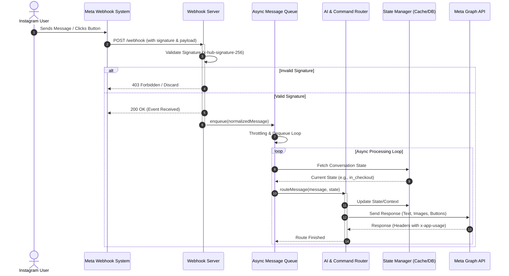

# Advanced Instagram Messaging Bot Architecture

This document describes the architectural patterns, security controls, message routing workflows, and system design patterns required to build a production-grade, highly interactive Instagram Direct Message (DM) bot.

---

## 1. Webhook Lifecycle & Requests

The Instagram bot operates on an **event-driven webhook architecture**. Messages, interactive button clicks (postbacks), media attachments, comments, and mentions are pushed as JSON payloads from Meta's servers to the bot's HTTP server.



### A. Webhook Verification (Handshake)
During setup, Meta validates the webhook URL by sending a `GET` request with query parameters. The bot must check:
*   `hub.mode === 'subscribe'`
*   `hub.verify_token === CONFIG_TOKEN`
*   If matched, return the `hub.challenge` plain-text string with a `200 OK` status.

### B. Payload Signature Validation
To prevent spoofing, every incoming `POST` request contains a header: `X-Hub-Signature-256`. 
*   **Validation Method**: The bot creates an HMAC SHA256 signature of the raw incoming request body bytes using the application's `app_secret` as the key.
*   The request is only processed if the calculated signature matches the header signature.

### C. Asynchronous Response Cycle
> [!IMPORTANT]
> Meta expects a response within **20 seconds**. If the server takes longer (due to database reads, image creation, or external requests), Meta will timeout and retry the webhook, resulting in duplicate message processing.
>
> **Pattern**: The handler returns `200 OK` ("EVENT_RECEIVED") **instantly** upon receiving the request, then delegates the payload to an in-memory queue to be processed asynchronously.

---

## 2. Component Design & Orchestration

An advanced Instagram bot uses a modular, decoupled structure:

```
[Instagram Webhook]
       │
       ▼
 ┌───────────┐        ┌─────────────┐
 │ Webhook   │───────▶│ CoreClient  │ (State & Settings)
 │ Server    │        └──────┬──────┘
 └───────────┘               │
                             ├──────────────┬──────────────┬──────────────┐
                             ▼              ▼              ▼              ▼
                       ┌───────────┐  ┌───────────┐  ┌───────────┐  ┌───────────┐
                       │  Message  │  │  Command  │  │   State   │  │    API    │
                       │   Queue   │  │  Router   │  │  Manager  │  │  Handler  │
                       └─────┬─────┘  └─────┬─────┘  └─────┬─────┘  └─────┬─────┘
                             │              │              │              │
                             ▼              ▼              ▼              ▼
                       [Rate Limiter]  [AI & NLP/    [Redis/Mongo]  [Meta Graph
                                       Handlers]                     API v21.0]
```

### A. Core Client Orchestrator
Holds configuration settings, active session maps, and coordinates helper instances.

### B. Message Queue & Throttling
*   Protects the server from spam by putting messages into a processing queue.
*   Processes items sequentially using `setImmediate()` to ensure the Node.js event loop remains unblocked.
*   Enforces user-level rate limits before triggering database operations.

### C. AI & Command Router
*   Routes incoming inputs to NLP engines (e.g., Gemini, OpenAI) or strict command modules.
*   Determines context based on user profile and active state.

---

## 3. Rate Limiting System

To maintain API stability, the bot must employ two distinct rate-limiting strategies:

1.  **Global API Throttling (Graph API)**:
    Meta includes the `x-app-usage` header in response headers (e.g., `{"call_count":80,"total_cputime":12,"total_time":20}`). The bot monitors this value and pauses API calls (entering a 15-minute cooldown) if the total usage nears 90%.
2.  **User Command Throttling**:
    Tracks individual users in an in-memory map. If a user sends more than 10 commands in 10 seconds or 3 commands in 1 second, they are temporarily blocked and receive an alert message.

---

## 4. Interactive UX Templates

The Instagram Messenger API has strict UI layout limits:

*   **Buttons (Postbacks)**: A generic template card can support at most **3 buttons**. Buttons must trigger a `postback` payload or navigate to a `web_url`.
*   **Carousels**: A carousel template supports up to **10 cards**, each with a title, description, image, and up to 3 buttons.
*   **Device Limitations**: Interactive buttons only function on the Instagram mobile application. Desktop users must type the commands manually. To support this, button payloads are identical to command texts (e.g., `!help`), allowing the message parser to handle button clicks and text inputs identically.

---

## 5. State Management & Multi-Turn Conversations

Advanced bots need to handle multi-step workflows (e.g., quizzes, purchase checkouts, or user registration flows).

*   **Session State**: Every user session is cached (typically in Redis or MongoDB) with a schema tracking:
    *   `state`: Current state identifier (e.g., `awaiting_email`, `viewing_cart`).
    *   `data`: Contextual data collected so far (e.g., items selected, answers given).
    *   `timestamp`: Expiry time to clean up abandoned sessions.
*   **Routing Decisions**: When a user sends a message, the router first checks their active session state. If an active state exists, the input is redirected to the corresponding state handler instead of the general command list.

---

## 6. AI & Natural Language Processing (NLP) Layer

For a premium user experience, bots incorporate an AI/NLP routing layer:

1.  **Intent Classification**: When free-text is received, the input is passed to an LLM or NLP classifier to identify intent (e.g., `check_balance`, `ask_question`, `cancel`).
2.  **Entity Extraction**: Extract key parameters from the user's sentence (e.g., "Show me blue shirts" -> color: "blue", item: "shirt").
3.  **Fallback to Agent**: If the AI confidence score is low, the conversation state is updated to `flagged_for_agent`, and the bot suspends automated responses until a human administrator reviews the chat.
